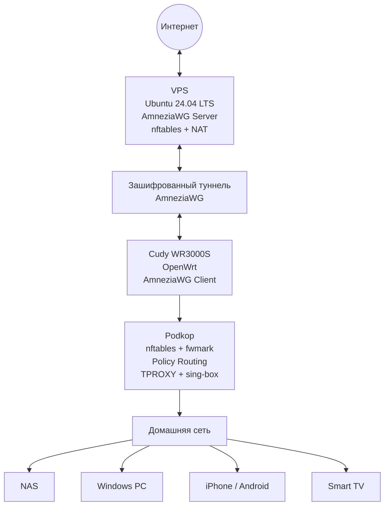

# 🚀 AmneziaWG Self-Hosted

[](https://ubuntu.com/)
[](https://openwrt.org/)
[](LICENSE)
[](docs/)
[](#-статус-проекта)

Полное русскоязычное руководство по развёртыванию собственного сервера **AmneziaWG 2.0** с нативным модулем ядра Linux, веб-панелью управления, защищённым доступом, Split Routing, OpenWrt, Podkop и резервным копированием.

В отличие от установок, где VPN-сервер работает внутри Docker-контейнера или через userspace-реализацию, в этом проекте AmneziaWG интегрирован непосредственно в сетевой стек Linux. Это устраняет дополнительный контейнерный и userspace-overhead: фактическая скорость определяется пропускной способностью и производительностью VPS, качеством маршрута и возможностями клиентского устройства.

> [!NOTE]
> В проекте используется полноценная реализация **AmneziaWG 2.0 в виде модуля ядра Linux**, а не VPN-туннель внутри Docker-контейнера.
>
> Обработка пакетов выполняется непосредственно в ядре системы, поэтому отсутствует дополнительное ограничение производительности со стороны контейнера или userspace-туннеля. При достаточных ресурсах VPS скорость может приближаться к пропускной способности сетевого канала.

Документация основана на реально работающей конфигурации:

- VPS с Ubuntu 24.04 LTS;
- AmneziaWG Server;
- nftables;
- Windows и iOS-клиенты;
- Cudy WR3000S с OpenWrt;
- Podkop;
- sing-box;
- TPROXY;
- Policy Routing.

> [!IMPORTANT]
> Репозиторий содержит только обезличенные примеры. Приватные ключи, клиентские конфигурации, токены, пароли и резервные архивы публиковать нельзя.

---

## ✨ Возможности

- ✅ Собственный VPN-сервер AmneziaWG на Ubuntu
- ✅ Веб-панель для управления клиентами
- ✅ Доступ к панели только из VPN-сети
- ✅ Фильтрация и NAT средствами nftables
- ✅ Split Routing для Windows
- ✅ Клиенты Windows и iPhone
- ✅ Подключение OpenWrt-роутера
- ✅ Интеграция с Podkop
- ✅ Маршрутизация через sing-box и TPROXY
- ✅ Policy Routing с отдельной таблицей маршрутизации
- ✅ Резервное копирование и восстановление
- ✅ Практическая диагностика неисправностей
- ✅ Нативный модуль AmneziaWG 2.0 в ядре Linux
- ✅ Отсутствие Docker/userspace-overhead при обработке VPN-трафика

---

## 🏗️ Архитектура



### Путь трафика через VPN

```text
Клиентское устройство
        ↓
Cudy OpenWrt
        ↓
Podkop
        ↓
nftables: fwmark 0x100000
        ↓
Policy Routing: table podkop
        ↓
TPROXY
        ↓
sing-box: 127.0.0.1:1602
        ↓
AmneziaWG: awg0
        ↓
VPS
        ↓
NAT / Masquerade
        ↓
Интернет
```

> [!NOTE]
> Split Routing реализуется на стороне клиентов. VPS принимает уже выбранный трафик, выполняет маршрутизацию и NAT, но не определяет, какие сайты должны использовать VPN.

---

## ⚡ Быстрый старт

Последовательно пройдите основные главы:

1. [Подготовьте VPS](docs/01-vps-preparation.md).
2. [Установите AmneziaWG](docs/02-amneziawg-installation.md).
3. [Настройте веб-панель](docs/03-web-panel.md).
4. [Настройте firewall и NAT](docs/04-firewall.md).
5. [Выберите схему Split Routing](docs/05-split-routing.md).
6. Подключите необходимое устройство:
   - [Windows](docs/06-client-windows.md);
   - [iPhone](docs/07-client-ios.md);
   - [Cudy с OpenWrt](docs/08-cudy-openwrt.md).
7. [Настройте Podkop и выборочную маршрутизацию](docs/09-podkop.md).
8. [Создайте резервные копии](docs/10-backup-restore.md).
9. При проблемах используйте [руководство по диагностике](docs/11-troubleshooting.md).

> [!TIP]
> Не переходите к Podkop, пока интерфейс `awg0` на OpenWrt не поднимается автоматически и не показывает свежий Handshake.

---

## 📚 Документация

### История и контекст

- ✅ [00. История проекта](docs/00-project-history.md) — задачи проекта, принятые решения и итоговая архитектура.

### Сервер

- ✅ [01. Подготовка VPS](docs/01-vps-preparation.md)
- ✅ [02. Установка AmneziaWG](docs/02-amneziawg-installation.md)
- ✅ [03. Web Panel](docs/03-web-panel.md)
- ✅ [04. Firewall](docs/04-firewall.md)

### Маршрутизация и клиенты

- ✅ [05. Split Routing](docs/05-split-routing.md)
- ✅ [06. Клиент Windows](docs/06-client-windows.md)
- ✅ [07. Клиент iPhone](docs/07-client-ios.md)
- ✅ [08. OpenWrt на Cudy](docs/08-cudy-openwrt.md)
- ✅ [09. Podkop и выборочная маршрутизация](docs/09-podkop.md)

### Эксплуатация

- ✅ [10. Резервное копирование и восстановление](docs/10-backup-restore.md)
- ✅ [11. Диагностика и устранение неисправностей](docs/11-troubleshooting.md)

---

## 🧰 Используемые технологии

| Компонент | Назначение |
|---|---|
| Ubuntu 24.04 LTS | Операционная система VPS |
| AmneziaWG 2.0 kernel module | Нативная обработка VPN-трафика в ядре Linux |
| nftables | Firewall, фильтрация, NAT и маркировка |
| OpenWrt | Операционная система маршрутизатора |
| Cudy WR3000S | Домашний VPN-шлюз |
| Podkop | Выборочная маршрутизация |
| sing-box | Обработка перенаправленного трафика |
| TPROXY | Прозрачный перехват TCP/UDP |
| Policy Routing | Маршрутизация пакетов по `fwmark` |
| Git | Версионирование документации и примеров |

---

## 🔍 Проверенная конфигурация

В рабочей конфигурации используются следующие параметры:

```text
VPN-интерфейс сервера: awg0
VPN-сеть:              10.66.66.0/24
VPN-адрес сервера:     10.66.66.1
UDP-порт сервера:      53925
Web Panel:             10.66.66.1:8080
OpenWrt-клиент:        10.66.66.4/32
Policy fwmark:         0x100000
Routing table:         podkop
sing-box TPROXY:       127.0.0.1:1602
```

Примеры ожидаемой диагностики:

```text
105: from all fwmark 0x100000 lookup podkop
```

```text
local default dev lo scope host
```

```text
/usr/bin/sing-box run -c /etc/sing-box/config.json
```

> [!WARNING]
> Эти адреса и порты относятся к конфигурации, описанной в руководстве. При собственной установке они могут отличаться.

---

## 📁 Структура проекта

```text
.
├── configs/
│   ├── awg0.example.conf
│   ├── nftables.example
│   └── params.example
│
├── docs/
│   ├── 00-project-history.md
│   ├── 01-vps-preparation.md
│   ├── 02-amneziawg-installation.md
│   ├── 03-web-panel.md
│   ├── 04-firewall.md
│   ├── 05-split-routing.md
│   ├── 06-client-windows.md
│   ├── 07-client-ios.md
│   ├── 08-cudy-openwrt.md
│   ├── 09-podkop.md
│   ├── 10-backup-restore.md
│   └── 11-troubleshooting.md
│
├── assets/
├── diagrams/
├── examples/
├── images/
├── scripts/
├── CHANGELOG.md
├── CONTRIBUTING.md
├── SECURITY.md
├── LICENSE
└── README.md
```

> [!NOTE]
> Некоторые каталоги могут оставаться пустыми до добавления схем, скриншотов, автоматизации и дополнительных примеров.

---

## 🔐 Безопасность

В публичный репозиторий нельзя добавлять:

- `PrivateKey`;
- `PresharedKey`;
- реальные клиентские `.conf`;
- QR-коды клиентов;
- токены и пароли;
- базу данных веб-панели;
- резервные архивы;
- приватные IP-адреса административной инфраструктуры;
- SSH-ключи;
- файлы с переменными окружения.

Перед каждым коммитом рекомендуется выполнять:

```bash
git diff --cached
```

Поиск потенциально опасных данных:

```bash
grep -RniE \
  'PrivateKey|PresharedKey|password|passwd|token|secret|BEGIN (RSA|OPENSSH|EC) PRIVATE KEY' \
  . \
  --exclude-dir=.git
```

Подробнее: [SECURITY.md](SECURITY.md).

---

## ✅ Требования

Минимальная рекомендуемая конфигурация VPS:

- Ubuntu 22.04 LTS или Ubuntu 24.04 LTS;
- 1 vCPU;
- 1 GB RAM;
- 10 GB SSD;
- публичный IPv4;
- SSH-доступ;
- разрешённый входящий UDP-порт.

Для OpenWrt-сценария также потребуется:

- совместимый маршрутизатор;
- доступ по SSH;
- достаточно свободной flash-памяти;
- поддержка AmneziaWG;
- возможность установки Podkop и sing-box.

---

## 🚦 Статус проекта

Проект находится в рабочем состоянии.

Проверены:

- ✅ развёртывание VPS;
- ✅ установка AmneziaWG;
- ✅ работа Web Panel;
- ✅ firewall и NAT;
- ✅ Windows-клиент;
- ✅ iPhone-клиент;
- ✅ Cudy WR3000S с OpenWrt;
- ✅ Podkop;
- ✅ sing-box;
- ✅ Split Routing;
- ✅ резервное копирование;
- ✅ базовая диагностика.

Документация завершена, но может дополняться новыми примерами, скриншотами и вариантами конфигурации.

---

## 🤝 Участие в проекте

Исправления, дополнения и новые практические сценарии приветствуются.

Перед отправкой изменений:

1. изучите [CONTRIBUTING.md](CONTRIBUTING.md);
2. проверьте отсутствие секретов;
3. используйте обезличенные примеры;
4. убедитесь, что все внутренние ссылки работают;
5. кратко опишите внесённые изменения.

---

## 🎯 Цель проекта

Большинство инструкций по AmneziaWG заканчивается после установки VPN-сервера.

Этот проект описывает полный жизненный цикл:

- подготовку VPS;
- установку и защиту сервера;
- управление клиентами;
- Split Routing;
- подключение Windows и iOS;
- интеграцию с OpenWrt;
- работу Podkop, TPROXY и sing-box;
- резервное копирование;
- восстановление;
- диагностику неисправностей.

Все инструкции основаны на реально работающей конфигурации и сопровождаются проверочными командами.

---

## 📄 Лицензия

Проект распространяется по лицензии MIT.

Подробности находятся в файле [LICENSE](LICENSE).
