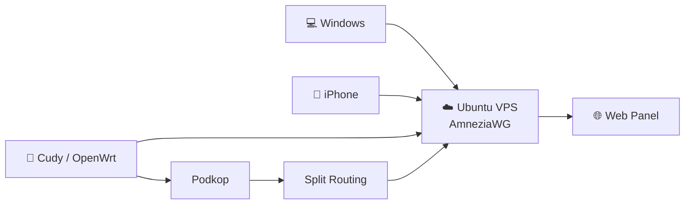

# 🚀 AmneziaWG Self-hosted


[](LICENSE)


> Полное руководство по развёртыванию собственного сервера **AmneziaWG** с веб-панелью управления, Split Routing, OpenWrt (Cudy), Podkop и защищённой инфраструктурой.

---

## ✨ Возможности

- ✅ Собственный VPN-сервер AmneziaWG на Ubuntu
- ✅ Современная Web Panel для управления клиентами
- ✅ Split Routing через `AllowedIPs`
- ✅ Защищённый доступ к Web Panel только из VPN
- ✅ Клиенты Windows
- ✅ Клиенты iPhone (iOS)
- ✅ Подключение OpenWrt (Cudy)
- ✅ Интеграция с Podkop
- ✅ Резервное копирование сервера
- ✅ Восстановление после сбоя
- ✅ Диагностика типичных проблем
- ✅ Полностью воспроизводимая установка

---

# 🏗 Архитектура



---

## 📚 Документация

Начните с ознакомления с историей проекта:

- 📖 **[История проекта](docs/00-project-history.md)** — почему появился этот проект и какие задачи он решает.

### Основные главы

- ✅ [01. Подготовка VPS](docs/01-vps-preparation.md)
- ✅ [02. Установка AmneziaWG](docs/02-amneziawg-installation.md)
- 🚧 03. Web Panel
- 🚧 04. Firewall
- 🚧 05. Split Routing
- 🚧 06. Windows Client
- 🚧 07. iPhone Client
- 🚧 08. OpenWrt (Cudy)
- 🚧 09. Podkop
- 🚧 10. Backup & Restore
- 🚧 11. Troubleshooting

---

# 📂 Структура проекта

```
.
├── configs/
│   ├── awg0.example.conf
│   ├── nftables.example
│   └── params.example
│
├── docs/
│   ├── 01-vps-preparation.md
│   ├── 02-amneziawg-installation.md
│   ├── 03-web-panel.md
│   ├── 04-firewall.md
│   ├── 05-split-routing.md
│   ├── 06-client-windows.md
│   ├── 07-client-ios.md
│   ├── 08-cudy-openwrt.md
│   ├── 09-podkop.md
│   ├── 10-backup-restore.md
│   └── 11-troubleshooting.md
│
├── assets/
├── diagrams/
├── examples/
├── images/
├── scripts/
├── CHANGELOG.md
├── CONTRIBUTING.md
├── SECURITY.md
├── LICENSE
└── README.md
```
---

## 🤝 Для авторов

Если вы хотите дополнить проект новой главой или улучшить существующую документацию:

- 📄 Используйте единый шаблон: [TEMPLATE.md](docs/TEMPLATE.md)
- 📘 Ознакомьтесь с правилами: [CONTRIBUTING.md](CONTRIBUTING.md)
- 🔒 Перед публикацией проверьте рекомендации по безопасности: [SECURITY.md](SECURITY.md)

---

# 🎯 Цель проекта

Большинство инструкций по AmneziaWG заканчиваются установкой сервера.

Этот проект показывает полный цикл:

- развёртывание VPS;
- установка AmneziaWG;
- настройка Web Panel;
- Split Routing;
- OpenWrt;
- Podkop;
- резервное копирование;
- восстановление;
- поиск неисправностей.

Все инструкции основаны на **реально работающей конфигурации**, а не являются переписанными фрагментами официальной документации.

---

# 🔒 Безопасность

В репозиторий **никогда не должны попадать**:

- приватные ключи;
- реальные клиентские `.conf`;
- `PrivateKey`;
- `PresharedKey`;
- резервные архивы;
- база данных Web Panel;
- токены;
- пароли.

Все примеры в репозитории обезличены.

---

# ⚠️ Требования

Минимальная конфигурация VPS:

- Ubuntu 22.04 LTS или Ubuntu 24.04 LTS
- 1 vCPU
- 1 GB RAM
- 10 GB SSD
- публичный IPv4
- SSH-доступ

---

# 🚦 Статус проекта

Проект активно развивается.

На текущий момент полностью проверены:

- VPS
- AmneziaWG
- Windows
- iPhone
- OpenWrt (Cudy)
- Podkop
- Split Routing
- Backup

В процессе оформления документации.

---

# 📄 Лицензия

Проект распространяется по лицензии **MIT**.

Подробности см. в файле `LICENSE`.
