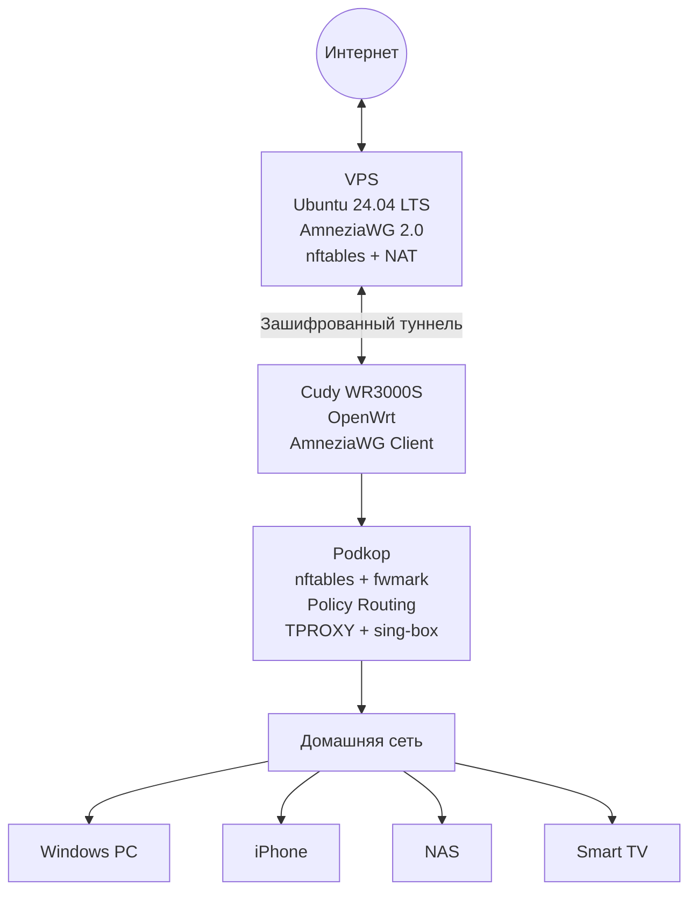

<div align="center">

# 🚀 AmneziaWG Self-Hosted

**Полное русскоязычное руководство по развёртыванию нативного AmneziaWG 2.0 на Ubuntu с OpenWrt, Podkop и выборочной маршрутизацией**

[](https://mannaro.github.io/amneziawg-selfhost/)
[](https://github.com/mannaro/amneziawg-selfhost/actions/workflows/docs.yml)
[](https://ubuntu.com/)
[](https://openwrt.org/)
[](LICENSE)

[**📖 Читать документацию**](https://mannaro.github.io/amneziawg-selfhost/)
&nbsp;&nbsp;•&nbsp;&nbsp;
[**⚡ Быстрый старт**](https://mannaro.github.io/amneziawg-selfhost/01-vps-preparation/)
&nbsp;&nbsp;•&nbsp;&nbsp;
[**🛠️ Диагностика**](https://mannaro.github.io/amneziawg-selfhost/11-troubleshooting/)

</div>

---

## Почему этот проект отличается

В проекте используется **AmneziaWG 2.0 в виде нативного модуля ядра Linux**, а не VPN-туннель внутри Docker-контейнера или userspace-реализация.

Пакеты обрабатываются непосредственно сетевым стеком Linux. Отсутствует дополнительный Docker/userspace-overhead, а фактическая производительность определяется ресурсами VPS, шириной его канала, качеством маршрута и возможностями клиентского оборудования.

> [!IMPORTANT]
> Это не сокращённая инструкция только по установке VPN-сервера. Руководство охватывает полный жизненный цикл системы: сервер, клиенты, OpenWrt, Podkop, маршрутизацию, резервное копирование и диагностику.

---

## Возможности

| Компонент | Реализация |
|---|---|
| VPN-сервер | Нативный AmneziaWG 2.0 на Ubuntu |
| Управление | Web Panel |
| Безопасность | nftables, закрытый доступ к панели |
| Маршрутизация | Split Routing и Policy Routing |
| Домашний шлюз | Cudy WR3000S с OpenWrt |
| Выбор трафика | Podkop |
| Перехват соединений | TPROXY |
| Обработка трафика | sing-box |
| Клиенты | Windows, iPhone и OpenWrt |
| Эксплуатация | Backup, Restore и Troubleshooting |

---

## Архитектура



---

## Документация

Полная версия руководства с удобной навигацией и поиском опубликована на GitHub Pages:

### **[mannaro.github.io/amneziawg-selfhost](https://mannaro.github.io/amneziawg-selfhost/)**

Основные разделы:

- [Подготовка VPS](https://mannaro.github.io/amneziawg-selfhost/01-vps-preparation/)
- [Установка AmneziaWG](https://mannaro.github.io/amneziawg-selfhost/02-amneziawg-installation/)
- [Web Panel](https://mannaro.github.io/amneziawg-selfhost/03-web-panel/)
- [Firewall и NAT](https://mannaro.github.io/amneziawg-selfhost/04-firewall/)
- [Split Routing](https://mannaro.github.io/amneziawg-selfhost/05-split-routing/)
- [Windows](https://mannaro.github.io/amneziawg-selfhost/06-client-windows/)
- [iPhone](https://mannaro.github.io/amneziawg-selfhost/07-client-ios/)
- [OpenWrt на Cudy](https://mannaro.github.io/amneziawg-selfhost/08-cudy-openwrt/)
- [Podkop](https://mannaro.github.io/amneziawg-selfhost/09-podkop/)
- [Резервное копирование](https://mannaro.github.io/amneziawg-selfhost/10-backup-restore/)
- [Диагностика](https://mannaro.github.io/amneziawg-selfhost/11-troubleshooting/)

---

## Проверенная архитектура маршрутизации

```text
Клиентское устройство
        ↓
Cudy OpenWrt
        ↓
Podkop
        ↓
nftables: fwmark 0x100000
        ↓
Policy Routing: table podkop
        ↓
TPROXY
        ↓
sing-box: 127.0.0.1:1602
        ↓
AmneziaWG: awg0
        ↓
VPS
        ↓
NAT / Masquerade
        ↓
Интернет
```

---

## Безопасность

Никогда не публикуйте:

- `PrivateKey`;
- `PresharedKey`;
- реальные клиентские конфигурации;
- QR-коды;
- токены и пароли;
- базы данных Web Panel;
- резервные архивы;
- SSH-ключи.

Перед публикацией изменений ознакомьтесь с [SECURITY.md](SECURITY.md).

---

## Участие в проекте

Исправления, дополнения и новые проверенные сценарии приветствуются.

Правила оформления находятся в [CONTRIBUTING.md](CONTRIBUTING.md).

---

## Лицензия

Проект распространяется по лицензии [MIT](LICENSE).
