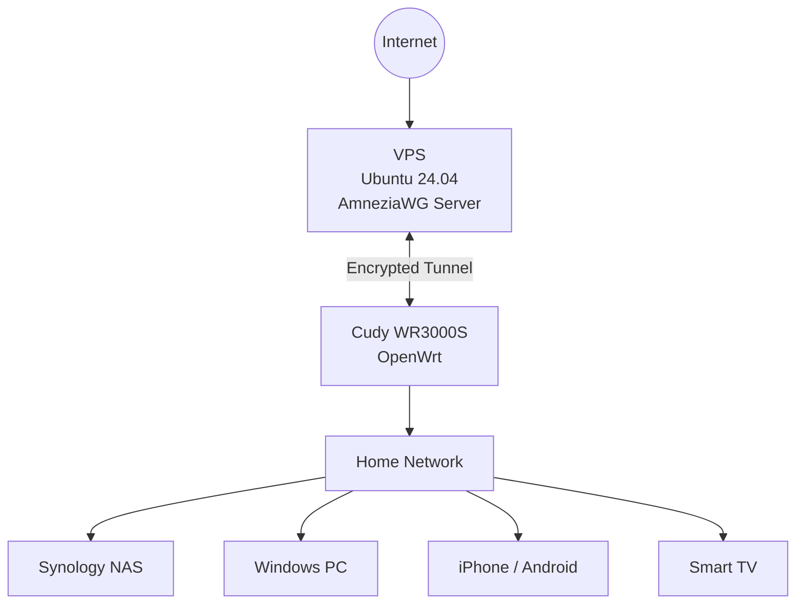

# Architecture

This diagram shows the reference deployment described in this repository.

```mermaid
flowchart TB

    Internet((Internet))

    VPS["VPS<br/>Ubuntu 24.04<br/>AmneziaWG Server"]

    Router["Cudy WR3000S<br/>OpenWrt"]

    LAN["Home Network"]

    NAS["Synology NAS"]

    PC["Windows PC"]

    Phone["iPhone / Android"]

    TV["Smart TV"]

    Internet --> VPS

    VPS <-- Encrypted Tunnel --> Router

    Router --> LAN

    LAN --> NAS
    LAN --> PC
    LAN --> Phone
    LAN --> TV
```
