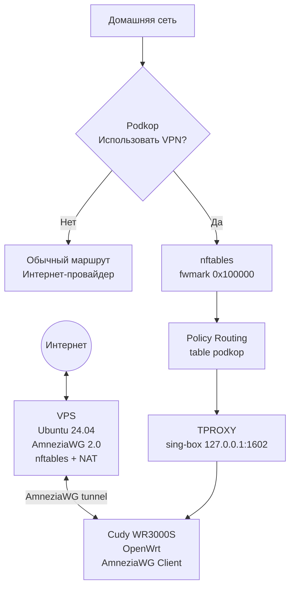

<div class="hero">

  <div class="hero-kicker">
    Нативный AmneziaWG 2.0 · Ubuntu · OpenWrt · Podkop
  </div>

  <div class="hero-title">
    <span class="hero-title-icon">🚀</span>
    <span>AmneziaWG Self-Hosted</span>
  </div>

  <div class="hero-subtitle">
    Полный цикл развёртывания собственного VPN
  </div>

  <p class="hero-description">
    Пошаговое русскоязычное руководство по установке
    <strong>AmneziaWG 2.0 с нативным модулем ядра Linux</strong>,
    настройке клиентов, OpenWrt, Podkop, выборочной маршрутизации
    и безопасной эксплуатации.
  </p>

  <div class="hero-buttons">
    <a class="hero-button" href="01-vps-preparation/">
      <span aria-hidden="true">🚀</span>
      <span>Начать установку</span>
    </a>

    <a class="hero-button" href="00-project-history/">
      <span aria-hidden="true">🗺️</span>
      <span>Изучить архитектуру</span>
    </a>

    <a
      class="hero-button"
      href="https://github.com/mannaro/amneziawg-selfhost"
    >
      <span aria-hidden="true">◉</span>
      <span>Открыть GitHub</span>
    </a>
  </div>

</div>

---

!!! info "Нативная реализация AmneziaWG"

    В проекте используется AmneziaWG 2.0 в виде модуля ядра Linux, а не VPN-туннель внутри Docker-контейнера или userspace-реализация.

    Обработка пакетов выполняется непосредственно сетевым стеком Linux. Фактическая скорость определяется производительностью VPS, шириной его канала, качеством маршрута и возможностями клиентского оборудования.

## Что получится в результате

<div class="feature-grid" markdown>

<div class="feature-card" markdown>

### 🖥️ Собственный VPS

Полностью контролируемый VPN-сервер на Ubuntu 24.04 LTS с нативным AmneziaWG.

</div>

<div class="feature-card" markdown>

### 🔐 Защищённый сервер

Firewall, NAT и ограничение доступа к Web Panel средствами nftables.

</div>

<div class="feature-card" markdown>

### 🔀 Split Routing

Через VPN передаётся только выбранный трафик. Основной интернет продолжает работать напрямую.

</div>

<div class="feature-card" markdown>

### 📡 OpenWrt

Маршрутизатор Cudy выступает централизованным VPN-шлюзом для домашней сети.

</div>

<div class="feature-card" markdown>

### 🧭 Podkop

Выборочная маршрутизация по доменам и спискам с использованием Policy Routing.

</div>

<div class="feature-card" markdown>

### 🛠️ Диагностика

Проверка Handshake, маршрутов, nftables, TPROXY, sing-box и полного пути пакета.

</div>

</div>

!!! tip "Списки адресов для Split Routing"

    Для формирования исходного списка IP-адресов в проекте использовался сервис
    [iplist.opencck.org](https://iplist.opencck.org/ru/).

    Подробный порядок подготовки и преобразования списка описан в главе
    [Split Routing](05-split-routing.md).

## Архитектура проекта

<div class="diagram-center" markdown>


</div>

### Путь выбранного пакета

<div class="packet-path" markdown>

```text
Устройство
    ↓
Cudy OpenWrt
    ↓
Podkop
    ↓
nftables: fwmark 0x100000
    ↓
ip rule
    ↓
table podkop
    ↓
local default dev lo
    ↓
TPROXY
    ↓
sing-box: 127.0.0.1:1602
    ↓
awg0
    ↓
VPS
    ↓
NAT
    ↓
Интернет
```
</div>

## Как проходить руководство

<div class="steps" markdown>

### 1. Подготовить сервер

Создайте VPS, защитите SSH и подготовьте Ubuntu.

[Перейти к подготовке VPS](01-vps-preparation.md)

### 2. Установить AmneziaWG

Разверните нативный модуль ядра, интерфейс `awg0` и серверную конфигурацию.

[Перейти к установке](02-amneziawg-installation.md)

### 3. Настроить управление и безопасность

Подключите Web Panel, nftables, NAT и защищённый доступ к панели.

[Web Panel](03-web-panel.md) · [Firewall](04-firewall.md)

### 4. Подключить клиентов

Настройте Windows, iPhone или маршрутизатор OpenWrt.

[Windows](06-client-windows.md) · [iPhone](07-client-ios.md) · [OpenWrt](08-cudy-openwrt.md)

### 5. Настроить выборочную маршрутизацию

Подключите Podkop, TPROXY, sing-box и Policy Routing.

[Split Routing](05-split-routing.md) · [Podkop](09-podkop.md)

### 6. Подготовиться к эксплуатации

Создайте резервные копии и изучите алгоритмы диагностики.

[Backup и Restore](10-backup-restore.md) · [Troubleshooting](11-troubleshooting.md)

</div>

## Проверенная конфигурация

<div class="config-table" markdown>

| Параметр | Значение |
|---|---|
| Серверный интерфейс | `awg0` |
| VPN-сеть | `10.66.66.0/24` |
| VPN-адрес сервера | `10.66.66.1` |
| UDP-порт | `53925` |
| Web Panel | `10.66.66.1:8080` |
| OpenWrt-клиент | `10.66.66.4/32` |
| Policy mark | `0x100000` |
| Routing table | `podkop` |
| sing-box TPROXY | `127.0.0.1:1602` |

</div>

!!! warning "Перед началом"

    Для каждого клиента создавайте отдельную конфигурацию.

    Никогда не публикуйте `PrivateKey`, `PresharedKey`, клиентские QR-коды, реальные конфигурации, токены, пароли или резервные архивы.

<div class="next-step" markdown>

## Готовы начать?

Первый практический этап — подготовка VPS и базовая защита сервера.

[Перейти к главе 01](01-vps-preparation.md){ .md-button .md-button--primary }

</div>
